# 模块联邦的动态化

## 背景

产品提出来一个需求，需要一个通用的业务组件，多个部门需要进行统一使用，然后组件的版本控制和升级迭代都放在我们这里。

常规的思路可能是把组件单独打包成一个 npm 包，然后分发到各个不同的业务线/仓库，让用户自己去升级，但是这会有以下 2 个缺点

    1. 包更新会比较麻烦，需要每个使用方升级版本，然后发版本上线
    2. 包版本管理不清楚，不知道各个业务方具体使用了哪些版本，一旦有大版本修改很难知道影响范围。

现在我们做 B 端的同学应该都比较熟悉微前端的方案，本质就是动态去加载对应的页面逻辑从而让各个不同的代码逻辑和业务能够聚合在一个网页中。
在 webpack5 时代，webpack 提供了一种新的包管理模式，模块联邦（module federation），可以用在微前端方案当中，但是本质上模块联邦就是为了解决动态包管理的问题。

## 模块联邦的特点与解决了什么问题

在看原理前我们先看下模块联邦的特点，以及解决了什么问题

1. 能够从其他地方托管的项目中获取模块
2. 不想使用者去担心跨系统同步升级它们
3. 类似普通 chunk 的实现，支持动态导入和代码拆分
4. 开发体验良好，在调用的时候有 ts 类型注释和代码注解
5. 和框架/库无关，不需要大规模改造原有应用
6. 希望独立部署，并且在运行时进行调用

## 模块联邦的使用

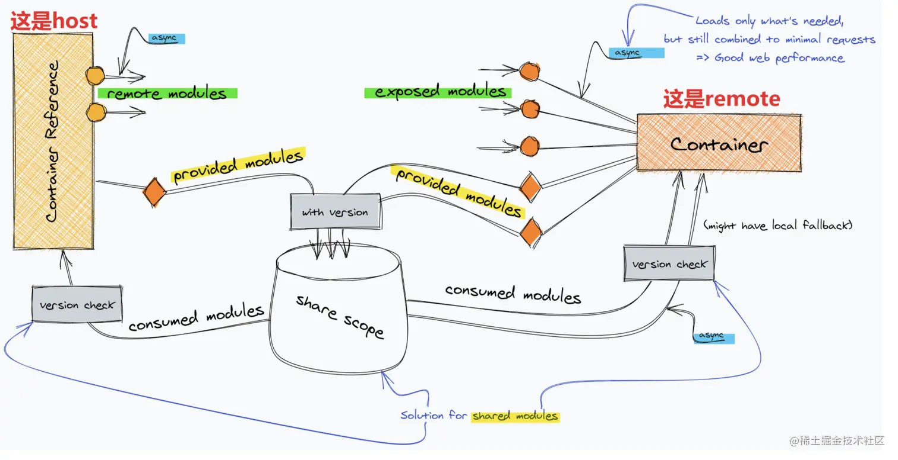

这张图就是模块联邦的原理，可以看到左侧是 host（模块使用方），右侧是 remote（模块提供方），在通过 webpack5 自带的插件 ModuleFederationPlugin 配置并且打包之后，host 可以提供出它自己内部的模块

```javascript
const { ModuleFederationPlugin } = require('webpack').container;
 new ModuleFederationPlugin({
      // 应用名，全局唯一，不可冲突。
      name: "component_app",
      // 暴露的文件名称
      filename: "remoteEntry.js",
      // 远程应用暴露出的模块名。
      exposes: {
        "./Button": "./src/Button.jsx",
        "./TimeShow": "./src/TimeShow.jsx",
      },
      // 依赖包 依赖的包 webpack在加载的时候会先判断本地应用是否存在对应的包，如果不存在，则加载远程应用的依赖包。
      shared: {
        react: {
          singleton: true
        },
        moment: {
          singleton: true
        }
      }
    }),`
```

然后可以被另外一个地方所消费（consume）

```javascript
new ModuleFederationPlugin({
      //远程访问地址入口
      remotes: {
        "component_app": "component_app@http://localhost:3001/remoteEntry.js",
        "util_app": "util_app@http://localhost:3003/remoteEntry.js",
      },
    }),

import Button from 'component_app/Button';
<Button></Button>
```

并且我们在图中可以看到，一个项目可以既是使用者，也可以是提供者。
中间通过 share scope 进行隔离各个模块之间的冲突，最后在构建的时候声明需要远程调用的的组件/远程提供的组件，并在运行时去访问模块并且执行。

## 模块联邦的问题

模块联邦依然会存在一些问题

1. 强制使用方和提供方使用 webpack5
2. 无版本概念，一旦较为中心的应用修改功能出错或发布出错，所有用到该模块的应用全部出错，印象面较大
3. 一旦入口资源加载失败之后，其暴露的模块相关功能将无法使用（不仅仅在模块联邦项目中）
4. ts 的提示不友好，调用的时候没有注解

## 进一步思考

### 和模块联邦不相同的部分

1.  &cross; 从其他项目中获得该模块，非中心化部署
    &check; 统一的配置平台，中心化部署
2.  &cross; 和框架/库无关
    &check; 使用 React/纯 js 作为主力开发框架与语言，轻量
3.  &cross; 无版本概念
    &check; 版本号+多版本同时部署与管理
4.  &cross; TS 不友好
    &check; TS 友好+代码注解
5.  &cross; 编译器确定组件
    &check; 运行时确定组件

### 和模块联邦相同的部分

1.  &check; 独立部署
2.  &check; 支持动态导入
3.  &check; 代码/样式隔离

## 整体思想

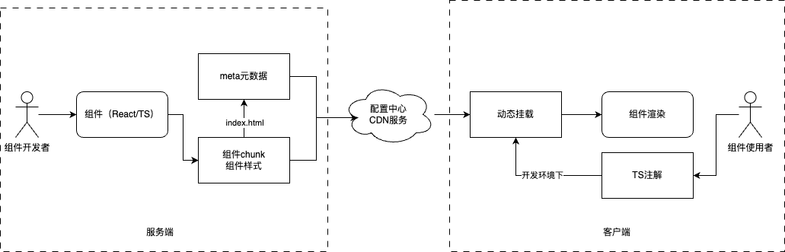

可以看到图中左侧是服务端，右侧是客户端，中间通过配置中心和 CDN 实现链接。形成了一个典型的单向数据流的系统

它期望是通过服务端进行配置下发，然后用户使用的时候只需要导入组件壳，即可动态导入组件并且进行组件渲染，同时也支持服务端进行动态升级

## hel-micro

介绍一下最近我们调研中的一个库： https://helmicro.com/hel/
支持模块联邦的 sdk 化，以及解决了以上的一些问题

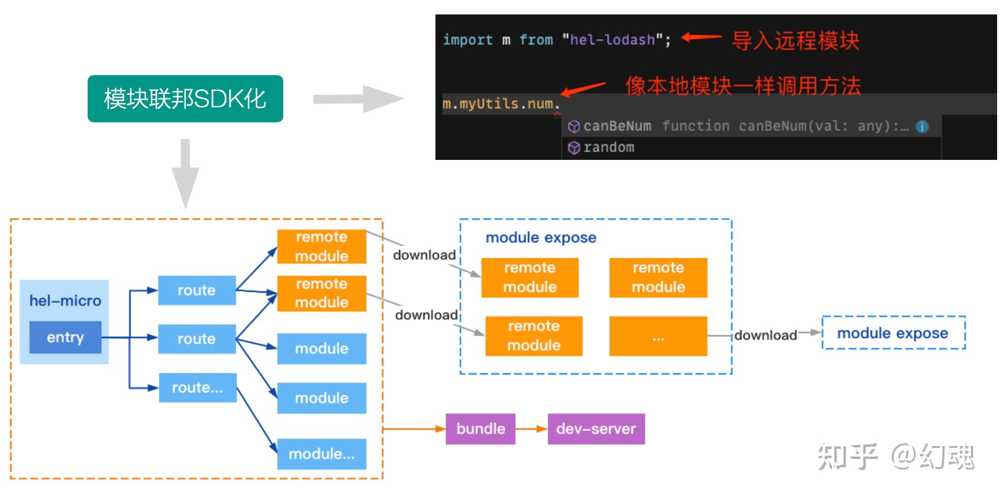

这张图是 hel 打包架构，可以看到还是一个组件还是需要作为一个 entry 来进行打包，并且导出的 remote 模块通过 expose 函数进行暴露出去，可以提供给业务方进行使用，并且也支持本地开发注解

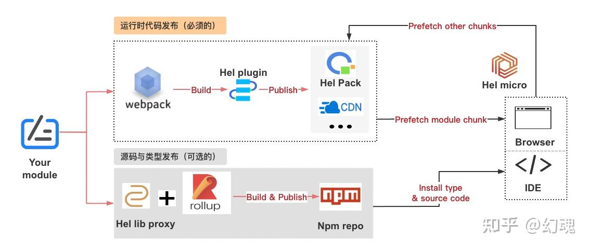

这张图是 hel 的部署方案，他支持内置 cdn（他们公司内网方案）和 npm 的 unpkg 方案（类似 js 加载），最终通过 prefetch 挂载到本地，当然也支持源码的发布方案

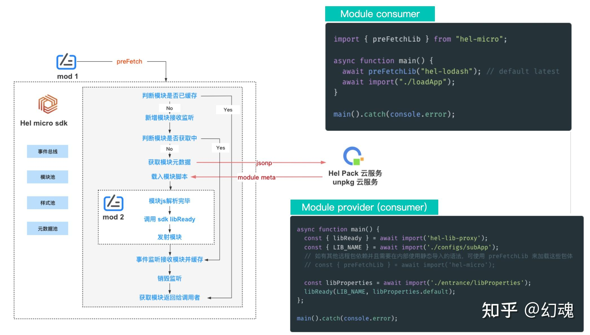

这张图是 hel 的本地加载方案，通过 prefetch 预加载对应的组件（注册），然后通过获取元数据进行加载组件和挂载组件，最终在对应的业务中进行使用

## hel-micro 使用

我们大致讲了下 hel 的具体流程，现在要看下首先这个东西具体是怎么用的

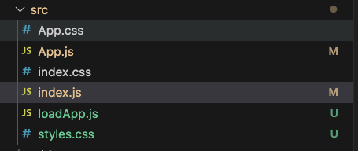

可以看到和寻常的 react 不同的是，多了一个 loadApp.js 的函数，
我们先看下 index.js 里面是什么

- 主入口文件

```javascript
import { preFetchLib, bindReactRuntime } from "hel-micro";
import React from "react";
import ReactDOM from "react-dom";
import ReactIs from "react-is";

bindReactRuntime({ React, ReactDOM, ReactIs }); // 公用react的运行时

async function main() {
  // 预加载远端组件
  await preFetchLib("hel-tpl-remote-react-comps-ts", {
    skip404Sniff: true,
    shadow: true,
  });

  // 动态导入入口
  await import("./loadApp");
}

main().catch(console.error);
```

- 动态导入入口

```javascript
import React, { StrictMode } from "react";
import { render } from "react-dom";

import App from "./App";

const rootElement = document.getElementById("root");

render(
  <StrictMode>
    <App />
  </StrictMode>,
  rootElement
);
```

可以看到和通常的 react 项目不同的是，我们先加载了一个 async 函数，await 了我们所需要的远程组件之后再 await 入口，而入口和我们常规 react 项目入口是一致的，调用 render 函数挂载到页面上。

- 使用

```javascript
import "./styles.css";
import React from "react";
// import { useRemoteComp } from "hel-micro-react";
import comps from "hel-tpl-remote-react-comps-ts";

export default function App() {
  const ref = React.useRef(null);
  const onClick = () => {
    ref.current?.sayHello();
  };

  // 加载 'hel-tpl-remote-react-comps' 或 'hel-tpl-remote-react-comps-ts'
  // 应用里的 HelloRemoteReactComp 组件
  // const Comp = useRemoteComp(
  //   // see https://github.com/hel-e co/hel-tpl-remote-react-comp
  //   "hel-tpl-remote-react-comps",
  //   // see https://github.com/hel-eco/hel-tpl-remote-react-comp-ts
  //   // "hel-tpl-remote-react-comps-ts",
  //   "HelloRemoteReactComp",
  //   { versionId: "1.3.2" }
  // );

  return (
    <div className="App">
      <h1>Hello hel-micro Remote Comp</h1>
      <h2 onClick={onClick}>Click me to see some magic happen!</h2>
      <comps.HelloRemoteReactComp ref={ref} />
    </div>
  );
}
```

使用的方法和常规组件是保持一致的，可以用 import 进行导入也可以通过 hooks 进行导入

## hel-micro 原理

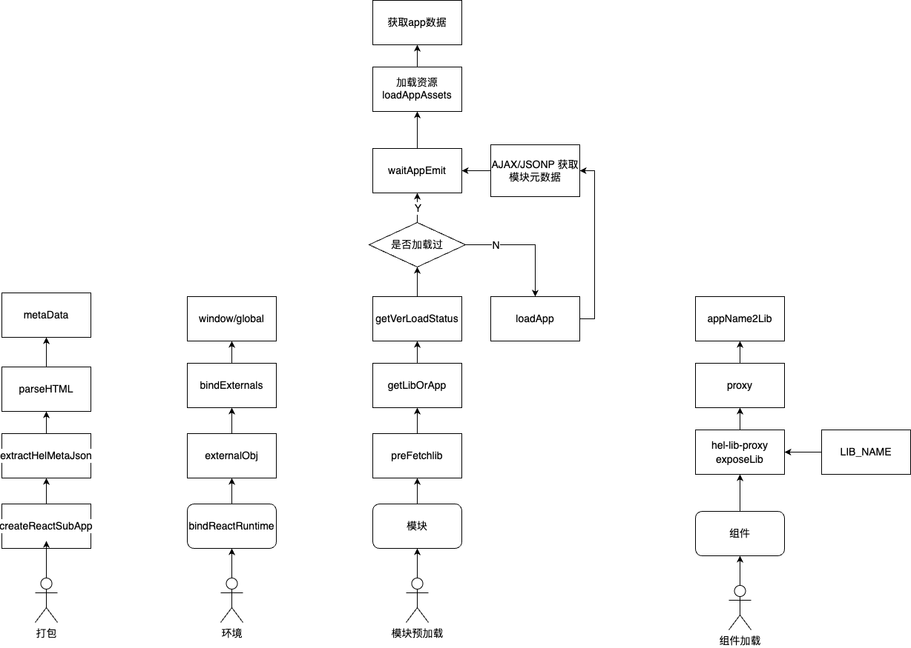

这张图是我看完源码之后整理的一个流程图，可以看到下面有 4 个小人分别对应

- 打包
- 环境注入
- 模块预加载
- 组件加载

正好是 hel 所需要的 4 项能力，我们主要过一下模块预加载和组件加载的部分

## hel-micro 预加载

大家在看源码之前首先得先想想，如果换做是你该怎么去做这个功能。

我自己第一个反应是

    模块本质上就是js函数，我们可以用<script> 标签去动态加载你所需要的js，
    至于css的话也是类似（<link>标签加载）也可以使用css-in-js

那我们怎么知道到底这个组件要加载哪一些 js 呢？

    如果了解 vue2-class方案 或者  nest框架（node）的同学可能会想到meta-data。
    这样可以在我们的组件上面加上装饰器注解
    但是meta-data一般都是静态的方案，需要编译的时候就打包进组件内了。
    我们需要一个动态的方案

最后是怎么加载组件

    如果是纯js函数可以直接挂载在window上面，没问题。
    如果是一个React组件挂载在window上面当然也是可行的，
    但是我们写代码的时候如何去引用呢？我们都是引用到node_modules里面的

首先是源码的根目录，可以看到是一个典型的 monorepo 的项目，我们的 prefetch 函数在 hel-micro 这个包中

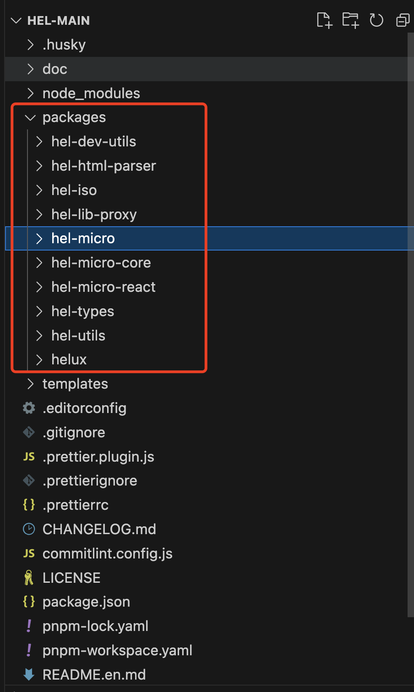

- preFetchLib

```javascript
export async function preFetchLib<T extends AnyRecord = AnyRecord>(appName: string, options?: IPreFetchLibOptions | VersionId): Promise<T> {
  const targetOpts = makePreFetchOptions(true, options); // 一些options，先不管
  const { emitApp, msg } = await innerPreFetch(appName, targetOpts); // 内部调用
  let appProperties = emitApp?.appProperties;
  return appProperties as unknown as T;
}
```

- innerPreFetch

```javascript
/**
 * 预抓取一些应用 js 脚本并解析执行，返回应用暴露的模块或组件
 * @param appName
 * @param preFetchOptions
 * @returns
 */
async function innerPreFetch(appName: string, preFetchOptions: IInnerPreFetchOptions) {
  let emitApp: null | IEmitAppInfo = null;
  // 删除了一些代码
  try {
    // 删除了一些代码
    let loadAssetsStarter: any = null;
    const currentLoadStatus = getVerLoadStatus(appName, fixedInnerOptions);
    // 删除了一些代码
    // 还未开始加载，标记加载中，防止连续的 preFetch 调用重复触发 loadApp
    if (currentLoadStatus !== helLoadStatus.LOADING) {
      setVerLoadStatus(appName, helLoadStatus.LOADING, fixedInnerOptions);
      loadAssetsStarter = await loadApp(appName, { ...fixedInnerOptions, controlLoadAssets: true });
    }
    // 正在加载中，等待模块获取
    emitApp = await waitAppEmit(appName, preFetchOptions, loadAssetsStarter);
    return { emitApp, msg: '' };
  } catch (err: any) {
    // 标记未加载，下次再进入可以继续重试
    setVerLoadStatus(appName, helLoadStatus.NOT_LOAD, fixedInnerOptions);
    return { emitApp, msg: err.message };
  }
}
```

我们看源码的时候，可以配合浏览器的单步调试来观察函数的上下文和返回值，便于我们进行理解，而且现在打包的都是 esm 方案，函数名一般都不会大改。

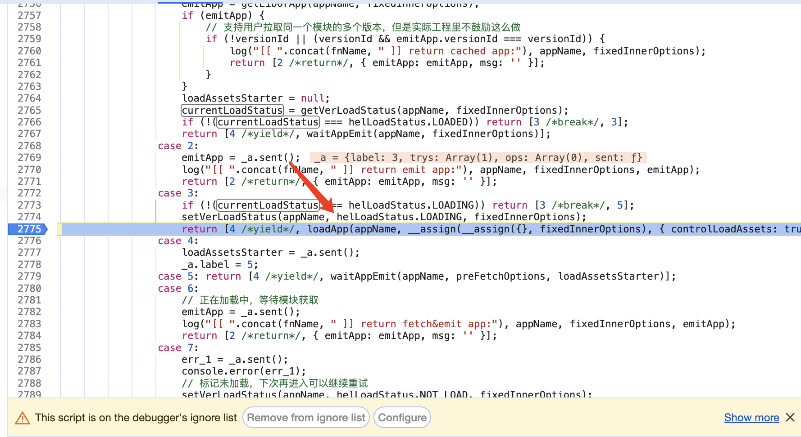

可以看到我们进入了 loadApp 函数

```javascript
/**
 * 加载应用的入口函数，先获取元数据，再加载资源
 */
export async function loadApp(appName: string, loadOptions: IInnerPreFetchOptions = {}): Promise<(() => void) | null> {
  const { isFirstCall = true, controlLoadAssets = false, platform, versionId = '' } = loadOptions;

  try {
    const { data, err } = await getAppWithFallback(appName, loadOptions);
    let { appInfo, appVersion } = data || {};
    const noMeta = !appInfo || !appVersion;
    let fromFallback = false;

    // 省略一些内容
    const startLoad = () => {
      loadAppAssets(appInfo as ISubApp, appVersion as ISubAppVersion, loadOptions);
    };

    // !!! 需要人工控制开始加载资源的时机
    if (controlLoadAssets) {
      return startLoad;
    }
    startLoad();
    return null;
  } catch (err: any) {
  // 省略一些内容
  }
}
```

这个函数里面我们可以看到，首先作者注释上面写了元数据也是获取的，然后再执行 startLoad 加载资源
我们可以先进入到 getAppWithFallback，最终发现底层是这个函数 getAndCacheApp

```javascript
export async function getAndCacheApp(
  appName: string,
  options: ISrvInnerOptions
) {
  const { platform, loadOptions } = options;
  const ret = await getAppAndVersion(appName, options);
  const { appInfo, appVersion } = ret;
  cacheApp(appInfo, { appVersion, platform, loadOptions });
  return ret;
}
```

```javascript
/**
 * 获取子应用和它的最新在线版本
 */
export async function getSubAppAndItsVersion(
  appName: string,
  getOptions: IHelGetOptions
) {
  // 省略了一些方法
  // 内部的请求句柄
  const innerRequest = async (custUrl?: string, custApiMode?: ApiMode) => {
    const metaUrl = custUrl || url;
    const reply = await executeGet(metaUrl, {
      apiMode: custApiMode || apiMode,
      semverApi: loadOptions?.semverApi,
    });
    if (0 !== parseInt(reply.code, 10) || !reply) {
      throw new Error(reply?.msg || "getSubAppAndItsVersion err");
    }
    return {
      app: ensureApp(reply.data.app),
      version: ensureVersion(reply.data.version),
      metaUrl,
    };
  };

  const data = await innerRequest();
  return data;
}
```

可以看到最后还是调用了 executeGet 来执行，最里面是调用了浏览器的 ajax 方法来请求返回数据，我们看下返回是什么数据

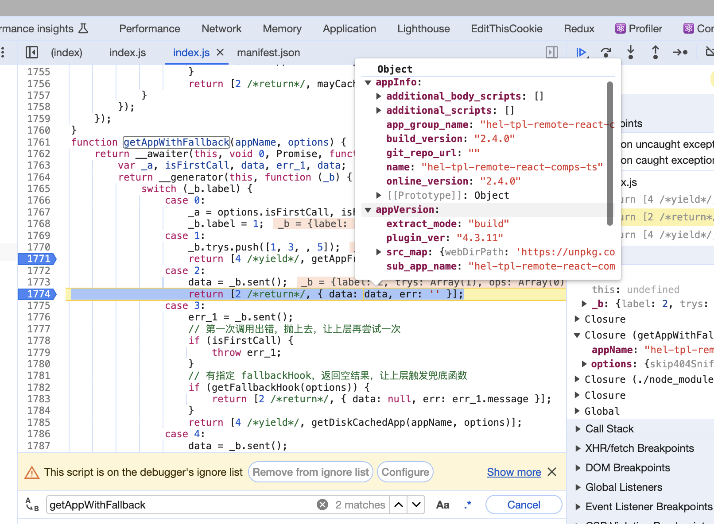

可以看到直接通过远端请求拿到了 metadata，我们看下远端请求

```JSON
{
  "app": {
    "name": "hel-tpl-remote-react-comps-ts",
    "app_group_name": "hel-tpl-remote-react-comps-ts",
    "git_repo_url": "",
    "online_version": "2.4.0",
    "build_version": "2.4.0"
  },
  "version": {
    "plugin_ver": "4.3.11",
    "extract_mode": "build",
    "sub_app_name": "hel-tpl-remote-react-comps-ts",
    "sub_app_version": "2.4.0",
    "src_map": {
      "webDirPath": "https://unpkg.com/hel-tpl-remote-react-comps-ts@2.4.0/hel_dist",
      "htmlIndexSrc": "https://unpkg.com/hel-tpl-remote-react-comps-ts@2.4.0/hel_dist/index.html",
      "extractMode": "all",
      "iframeSrc": "",
      "chunkCssSrcList": [
        "https://unpkg.com/hel-tpl-remote-react-comps-ts@2.4.0/hel_dist/static/css/291.0bcd258f.chunk.css",
        "https://unpkg.com/hel-tpl-remote-react-comps-ts@2.4.0/hel_dist/static/css/622.0bcd258f.chunk.css"
      ],
      "chunkJsSrcList": [
        "https://unpkg.com/hel-tpl-remote-react-comps-ts@2.4.0/hel_dist/static/js/main.aea1d0f2.js",
        "https://unpkg.com/hel-tpl-remote-react-comps-ts@2.4.0/hel_dist/static/js/291.522cd032.chunk.js",
        "https://unpkg.com/hel-tpl-remote-react-comps-ts@2.4.0/hel_dist/static/js/622.43eda72c.chunk.js"
      ],
      "staticCssSrcList": [],
      "staticJsSrcList": [
        "https://tnfe.gtimg.com/hel-external/level1/comb-16.14.0-react.js"
      ],
      "relativeCssSrcList": [],
      "relativeJsSrcList": [],
      "privCssSrcList": [],
      "headAssetList": [
        {
          "tag": "link",
          "append": false,
          "attrs": {
            "href": "https://unpkg.com/hel-tpl-remote-react-comps-ts@2.4.0/hel_dist/favicon.ico",
            "rel": "icon"
          }
        },
        {
          "tag": "staticScript",
          "append": false,
          "attrs": {
            "src": "https://tnfe.gtimg.com/hel-external/level1/comb-16.14.0-react.js"
          }
        },
        {
          "tag": "script",
          "append": true,
          "attrs": {
            "src": "https://unpkg.com/hel-tpl-remote-react-comps-ts@2.4.0/hel_dist/static/js/main.aea1d0f2.js",
            "defer": "defer"
          }
        }
      ],
      "bodyAssetList": []
    },
    "html_content": "<!doctype html><html lang=\"en\"><head><meta charset=\"utf-8\"/><link rel=\"icon\" href=\"https://unpkg.com/hel-tpl-remote-react-comps-ts@2.4.0/hel_dist/favicon.ico\"/><meta name=\"viewport\" content=\"width=device-width,initial-scale=1\"/><meta name=\"description\" content=\"Create Remote React Comp With hel-micro\"/><title>Remote React Comp</title><script src=\"https://tnfe.gtimg.com/hel-external/level1/comb-16.14.0-react.js\"></script><script defer=\"defer\" src=\"https://unpkg.com/hel-tpl-remote-react-comps-ts@2.4.0/hel_dist/static/js/main.aea1d0f2.js\"></script></head><body><noscript>You need to enable JavaScript to run this app.</noscript><div id=\"root\"></div></body></html>"
  }
}
```

是一样的东西，然后我们看下拿到这个之后怎么去加载 js

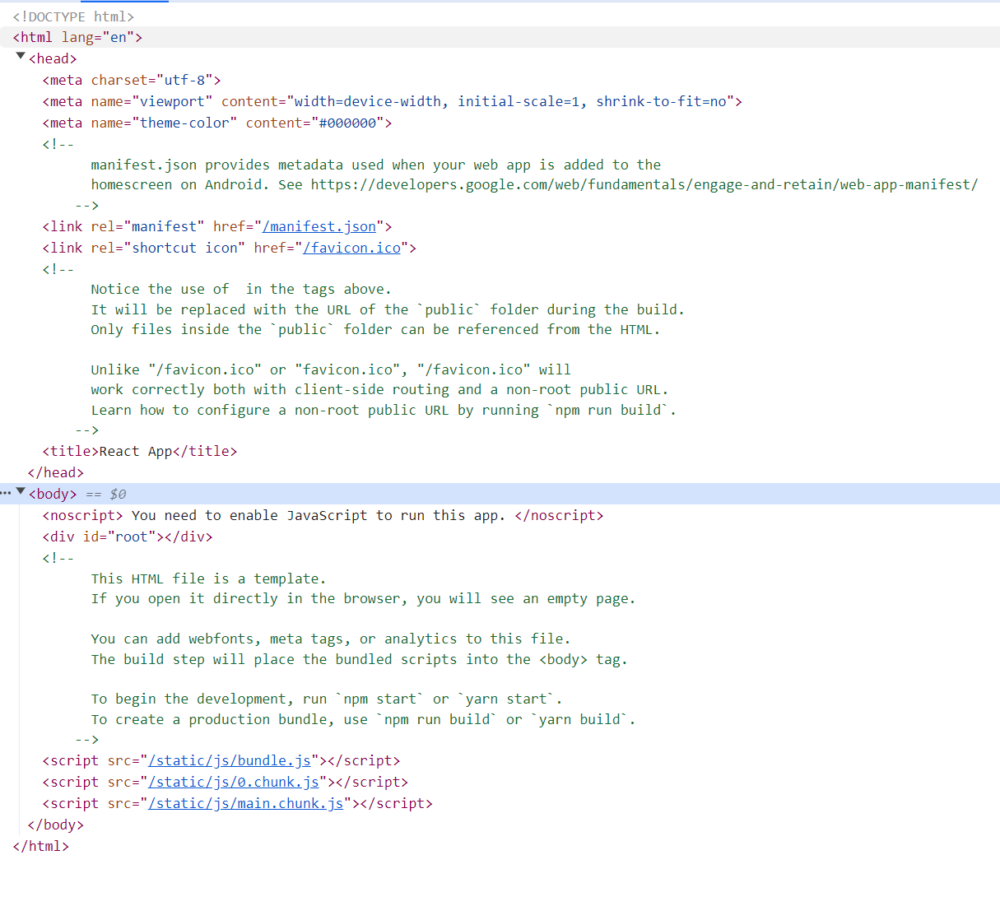

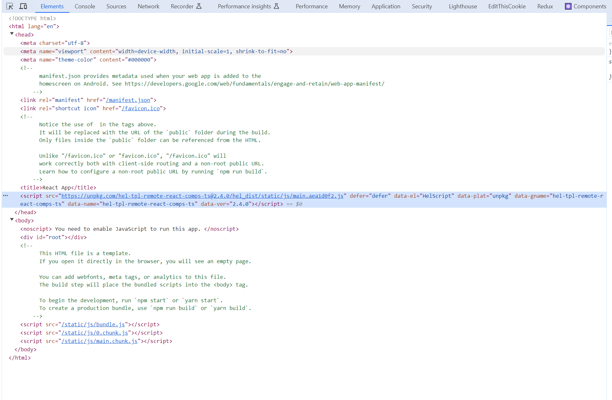

可以看到就加了一个 script 函数，那其他的内容到哪里去了呢

```javascript
/**
 * 加载应用首屏的各项资源
 */
export function loadAppAssets(
  app: ISubApp,
  version: ISubAppVersion,
  loadOptions: IInnerPreFetchOptions
) {
  // 重命名，避免 @typescript-eslint/naming-convention 警告
  const {
    additional_scripts: additionalScripts = [],
    additional_body_scripts: additionalBodyScripts = [],
  } = app;
  const {
    headAssetList = [],
    bodyAssetList = [],
    webDirPath,
    chunkCssSrcList = [],
  } = version.src_map;
  // 删除一些代码
  const optionsCommon = {
    excludeCssList,
    webDirPath,
    appendCss,
    cssAppendTypes,
  };
  // Object.assign is much faster than spread operator
  createDomByAssetList(
    headAssetList,
    assign(optionsCommon, { appendToBody: false })
  );
  createDomByAssetList(
    bodyAssetList,
    assign(optionsCommon, { appendToBody: true })
  );
}
```

可以看到最后调用 createDomByAssetList 函数

```javascript
function createDomByAssetList(
  assetList: IAssetItem[],
  options: ICreateDomOptions
) {
  const {
    appendToBody,
    appendCss,
    webDirPath,
    cssAppendTypes,
    excludeCssList,
  } = options;

  assetList.forEach((v) => {
    // 兼容历史元数据，无 append 的话就默认为 true
    const { tag, attrs, append = true, innerText = "" } = v;
    if (!append) {
      return;
    }
    // 处理 link 标签
    if (isLinkAttrs(tag, attrs)) {
      const createLinkOptions = { appendToBody, attrs, innerText };
      const { href } = attrs;
      // .ico 文件默认不加载（ 除非显式地记录了 append 为 true ）
      if (href.endsWith(".ico") && v.append !== true) {
        return;
      }

      if (href.endsWith(".css")) {
        if (
          appendCss &&
          cssAppendTypes.includes(getAssetUrlType(webDirPath, href)) && // 当前链接类型是合法的可以附加到 html 文档的链接类型
          !excludeCssList.includes(href) // 当前链接没有被设置在排除链接列表里
        ) {
          createLinkElement(createLinkOptions);
        }
        return;
      }

      createLinkElement(createLinkOptions);
      return;
    }
    // 处理 script 标签
    if (isScriptAttrs(tag, attrs)) {
      createScriptElement({ appendToBody, attrs, innerText });
    }
    // 处理 style 标签
    if (tag === "style") {
      createStyleElement({ appendToBody, attrs, innerText });
    }
  });
}
```

这里是分开处理挂载函数，我们看下如果挂载前后会发生什么事情

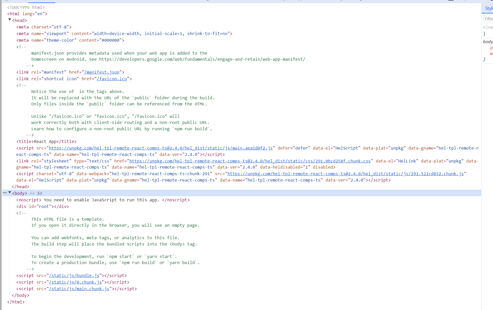

这个时候我们看下 hel 的挂载（挂载在自己的 namespace 下面而不是挂载在 window 下面）

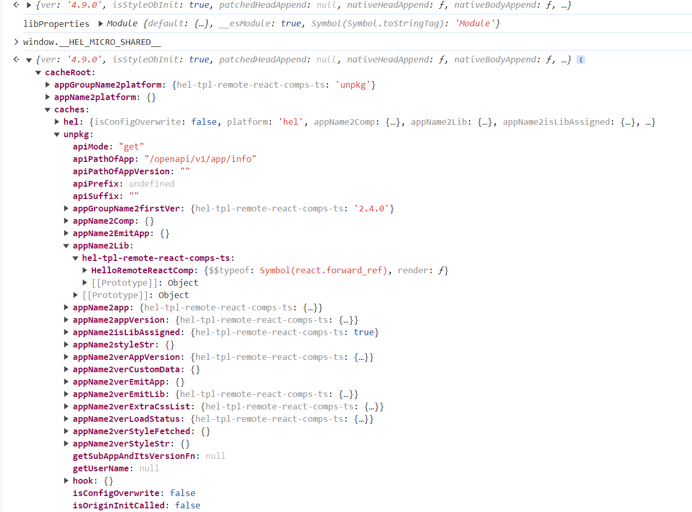

可以看到 lib 里面已经有了我们的 react 编译后的组件，所以说明这个操作不是在客户端完成的，是在服务端打包的时候就完成的

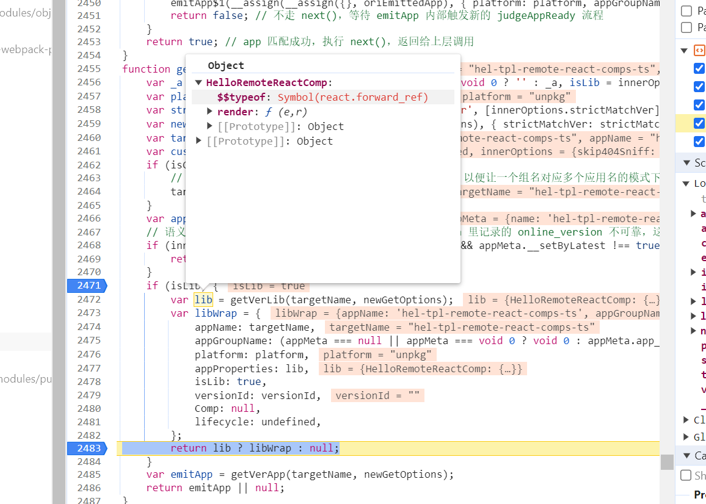

可以看到 lib 里面已经有了我们的组件，这个就是组件预加载的核心流程

## hel-micro 组件使用

我们在使用组件的时候，代码提示和调用是如何实现的

```javascript
/*
	|--------------------------------------------------------------------------
	|
	| 对应 package.json/name
	|
	|--------------------------------------------------------------------------
	*/
var LIB_NAME = "hel-tpl-remote-react-comps-ts";

var lib = helLibProxy.exposeLib(LIB_NAME);

exports["default"] = lib;
exports.lib = lib;

Object.defineProperty(exports, "__esModule", { value: true });
```

- 暴露出来的一个函数，可以看到最后调用了 getLibProxy

```javascript
export function exposeLib<L extends LibProperties>(libName: string, options?: IExposeLibOptions | Platform): L {
  let asProxy = true;
  let platform = '';
  if (options) {
    if (typeof options === 'string') {
      platform = options;
    } else {
      platform = options.platform || '';
      asProxy = options.asProxy ?? true;
    }
  }
  platform = platform || core.getAppPlatform(libName) || helConsts.DEFAULT_PLAT;

  let libObj = share.getLibObj<L>(libName, platform);
  if (typeof Proxy === 'function' && asProxy) {
    libObj = share.getLibProxy(libName, libObj, platform);
  }
  core.log('[[ exposeLib ]] libName, libObj', libName, libObj);
  return libObj;
}
```

- 代理函数

```javascript
export function getLibProxy<L extends LibProperties>(libName: string, libObj: L, platform?: Platform): L {
  return new Proxy(libObj, {
    get(target, key) {
      const strKey = String(key);
      log(`[[getLibProxy]] call lib [${libName}] method [${strKey}]`);
      if (Object.keys(target).length) {
        return target[strKey];
      }
      // 支持 resetGlobalThis 后，也能够安全获取到模块
      const safeTarget = getLibObj(libName, platform);
      return safeTarget[strKey];
    },
  });
}
```

最终是实现了一个代理，代理到我们刚刚看到缓存的地址上

## 结论

可以看到 hel 这个库是通过了获取模块的元数据，和动态导入了模块来实现了模块联邦

但是我们觉得在我们的场景下，hel处理了太多我们用不到的场景，并且为了在服务端实现元数据管理还要实现一整套后台的管理系统，相对来说整个库太重。

我们会基于我司内部的一整套方案，来实现自己的元数据打包和分发下载，并且内部的sdk元数据获取可以更加轻量化。
